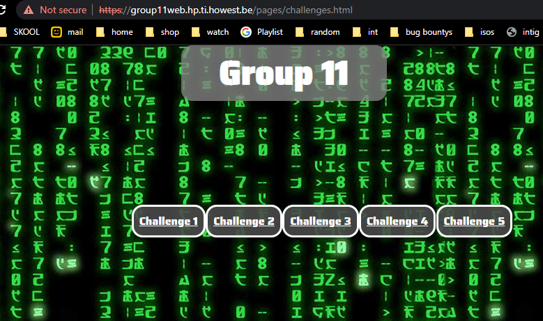

# Title
Goup11 not checking if logged in.

## Sevirity
This is a high risk because the data that is being giving is given to everyone and not only logged in users.

## Type of weakness
Login bypass

## Description
When i visited group 11's website logged in i saw the url and logged back out and then went back to the same url and i still got to the website.

## Summary
Its an easy bug to totally pypass the login:

## Steps to reproduce:
Go to https://group11web.hp.ti.howest.be/pages/challenges.html
