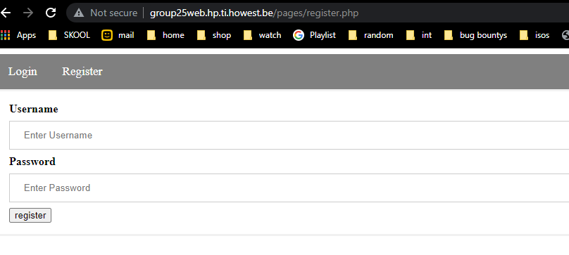
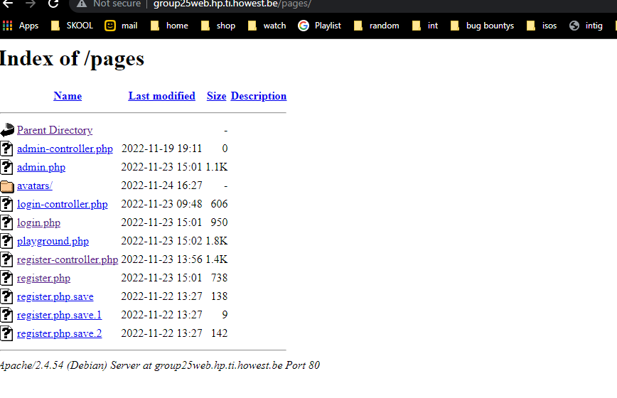
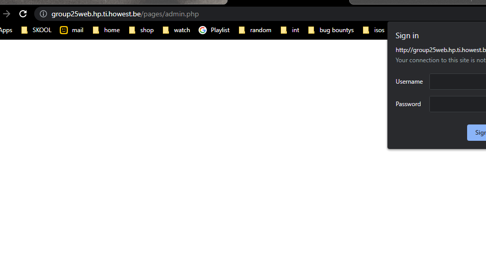

# Title
Goup25 directory listing.

## Sevirity
This is a medium risk because it only leads to data loss.

## Type of weakness
Directory listing

## Description
When i visited group 25's website and went to signup,
i saw:

The url took my interest so i removed the "register.php" and thats when i saw the directory listing:

## Summary
Because the directory listing,
and that's how i found:

## Steps to reproduce:
Remove "register.php"
from "http://group25web.hp.ti.howest.be/pages/register.php"
And press enter.
