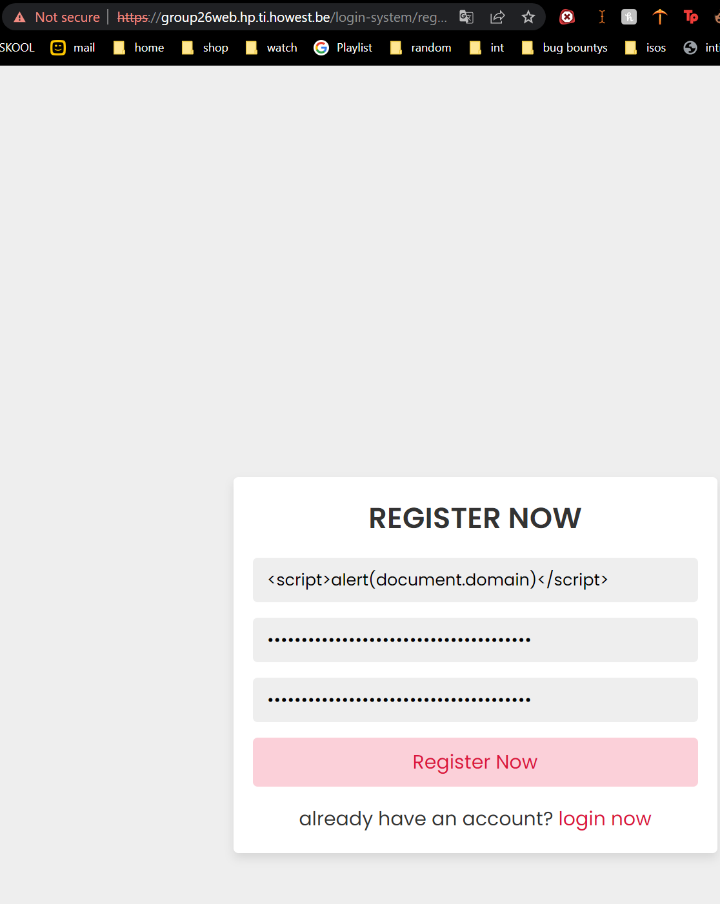
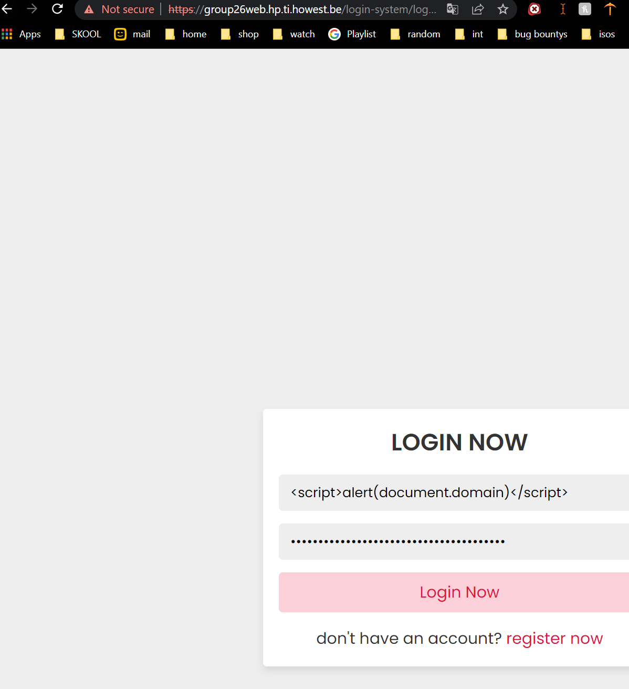
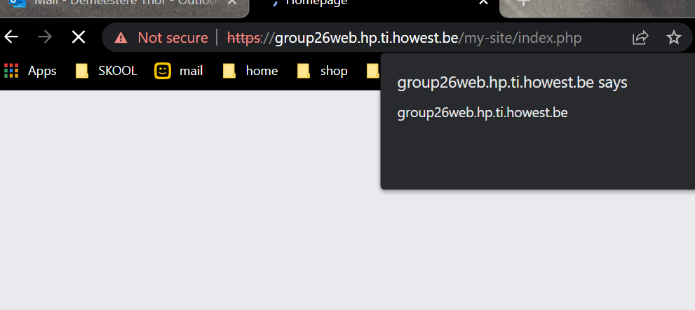

# Title
Goup27 stored XSS.

## Sevirity
Stored xss is a high risk because its easy to execute and there are al lot of tools to find it.

## Type of weakness
Stored xss

## Description
When putting the next payloa 
``
into any input field of the account signup it get saved,
when the user logs in or refreshes the page xss will pop.

## Summary
Its easy to find and quick to see if it works.

## Steps to reproduce:
Input the next paload
"" 
in any of the input fields while signing up
and wait for the alert to pop every time you log in or load a page.

