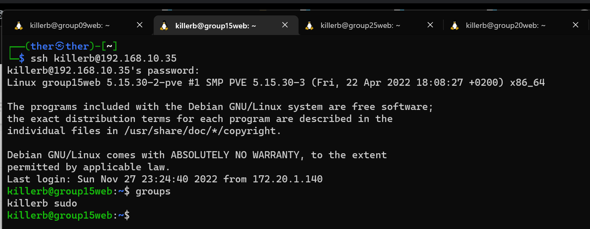

# Title
Goup 15 ssh default creds

## Sevirity
There are easy to write programs that can try to guess the default password for a ssh server. This is a very common attack. The attacker will try to guess the password for the ssh server. If the attacker is successful, he will be able to login to the ssh server and do whatever he wants.

(because we couldn't exploit it further i didn't check if this account still had sudo permissions or not)

## Type of weakness
Default credentials

## Description
The ssh server of group 15 has the default username and password.

## Summary
password: naruto
user: killerb
ssh killerb@group15web.ti.howest.be

## Steps to reproduce:

